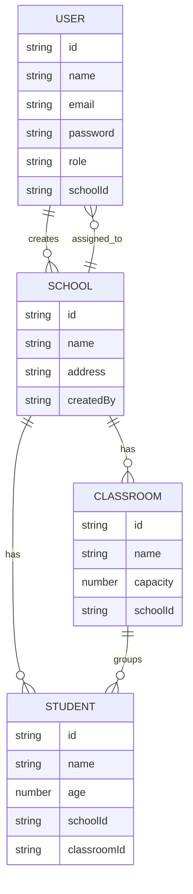

# School Management System API

Backend assessment project implementing a school management REST API using the provided template architecture.

## Stack
- Node.js
- Express
- MongoDB (Mongoose)
- JWT authentication

## Features
- JWT auth (`register`, `login`, `me`)
- RBAC (`superadmin`, `school_admin`)
- School management (superadmin only)
- School admin creation (superadmin only)
- Classroom management (school admin scoped to own school)
- Student management (school admin scoped to own school)
- Validation layer
- Global error handling
- Security headers
- Rate limiting
- OpenAPI docs at `/api/docs`

## Project Structure
- `index.js`: app bootstrap
- `config/`: env/config loading
- `loaders/`: manager/middleware/validator loaders
- `managers/entities/`: domain modules (`auth`, `school`, `user`, `classroom`, `student`)
- `mws/`: middleware modules (`__auth`, `__role`, etc.)
- `docs/openapi.js`: OpenAPI definition

## Setup
1. Install dependencies:
```bash
npm install
```

2. Create env file:
```bash
cp .env.example .env
```

3. Ensure infrastructure is running:
- MongoDB
- Redis (optional, only if `REDIS_ENABLED=true`)

4. Start app:
```bash
npm run dev
```

## Environment Variables
See `.env.example`.

Minimum required:
- `LONG_TOKEN_SECRET`
- `SHORT_TOKEN_SECRET`
- `NACL_SECRET`
- `MONGO_URI`
- Optional Redis stack: `REDIS_ENABLED=true` plus Redis URLs

## API Docs
- Swagger UI: `http://localhost:5111/api/docs`
- OpenAPI JSON: `http://localhost:5111/api/docs/openapi.json`

## Authentication Flow
1. `POST /api/auth/register` to create the first `superadmin` (one-time bootstrap).
2. `POST /api/auth/login` to get JWT token.
3. Send token in either:
- `Authorization: Bearer <token>`
- `token: <token>`
4. Access protected endpoints based on role rules.

## Auth
Use JWT as:
- `Authorization: Bearer <token>`
or
- `token: <token>`

## Endpoints

### Auth
- `POST /api/auth/register`
- `POST /api/auth/login`
- `GET /api/auth/me`

### Schools (superadmin)
- `POST /api/school/createSchool`
- `GET /api/school/listSchools`
- `GET /api/school/getSchool?schoolId=<id>`
- `PUT /api/school/updateSchool?schoolId=<id>`
- `DELETE /api/school/deleteSchool?schoolId=<id>`

### School Admins (superadmin)
- `POST /api/user/createSchoolAdmin`

### Classrooms (school_admin, own school only)
- `POST /api/classroom/createClassroom`
- `GET /api/classroom/listClassrooms`
- `PUT /api/classroom/updateClassroom?classroomId=<id>`
- `DELETE /api/classroom/deleteClassroom?classroomId=<id>`

### Students (school_admin, own school only)
- `POST /api/student/createStudent`
- `GET /api/student/listStudents`
- `PUT /api/student/updateStudent?studentId=<id>` (supports classroom change = student transfer)
- `DELETE /api/student/deleteStudent?studentId=<id>`

## Request/Response Format
- Success format:
```json
{
  "ok": true,
  "data": {},
  "errors": [],
  "message": ""
}
```
- Error format:
```json
{
  "ok": false,
  "data": {},
  "errors": ["..."],
  "message": "..."
}
```

## Error Codes
- `401`: Unauthorized (missing/invalid token)
- `403`: Forbidden (role not allowed)
- `404`: Route not found
- `422`: Validation errors
- `429`: Too many requests (rate limit)
- `500`: Internal server error

## Database Schema Design (ERD)


## Test Cases and Results
Run tests:
```bash
npm test
```

Current baseline tests:
- `tests/auth.test.js`: register/login flow
- `tests/protected-route.test.js`: protected RBAC route behavior

Example result:
```text
✔ auth register then login returns token and sanitized user
✔ protected route rejects non-allowed role and allows allowed role
pass 2
fail 0
```

## Deployment Instructions (Example: Render)
1. Push repository to GitHub (public).
2. Create a new Web Service on Render from the repo.
3. Build command: `npm install`
4. Start command: `npm start`
5. Set environment variables from `.env.example`:
- Required: `ENV`, `USER_PORT`, `MONGO_URI`, `LONG_TOKEN_SECRET`, `SHORT_TOKEN_SECRET`, `NACL_SECRET`
- Optional Redis: `REDIS_ENABLED=true` and Redis URLs
6. Deploy and verify:
- `/api/docs`
- Auth endpoints
- One protected endpoint

## Submission Checklist
- Public repository URL: `<ADD_REPO_URL>`
- Deployed API URL: `<ADD_DEPLOYED_URL>`
- README includes setup, auth flow, endpoints, errors, schema, tests, deployment notes.
- Swagger docs accessible at `/api/docs`.
- Tests pass with `npm test`.

## Assumptions
- First `register` call is used to bootstrap a single `superadmin`.
- School admins are created by superadmin and are scoped to one school.
- Student transfer is represented by updating `classroomId` via `updateStudent`.

## Deployment Readiness Notes
- Configure secrets via environment variables
- Set production `MONGO_URI`
- Optional: set Redis URLs and `REDIS_ENABLED=true` if using Redis stack
- Tune:
  - `RATE_LIMIT_WINDOW_MS`
  - `RATE_LIMIT_MAX`
  - `REQUEST_BODY_LIMIT`
